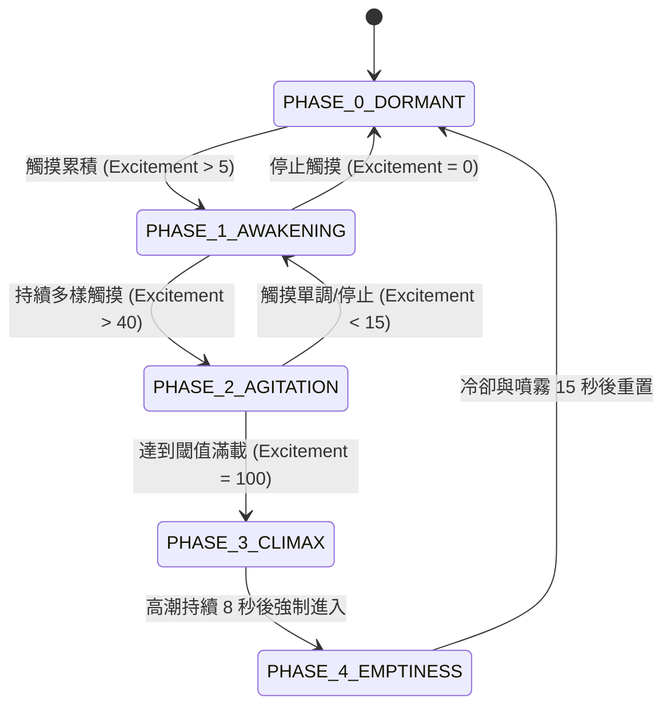

# 專案地圖 (Project Map)

本文件提供「15³ 情緒黑盒」系統架構的總覽，供所有開發者與 AI 快速對齊專案結構與模組關係。

## 目錄結構
```text
uno_q_prototype/
│
├── src/
│   └── main/
│       └── main.ino          # 核心韌體，包含狀態機與習慣化演算法
│
├── docs/
│   ├── hardware_spec.md      # 硬體規格與腳位定義
│   └── project_map.md        # 專案地圖 (本文件)
│
├── source/                   # 參考資料 (Datasheet 等)
│
├── agents.md                 # AI 代理人工作準則
├── changelog.md              # 版本變更紀錄
└── readme.md                 # 專案總覽
```

## 系統架構圖 (System Architecture)

```mermaid
graph TD
    subgraph 電源供應 (Power)
        A[6.5V-12V DC IN] --> B(麵包板 5V 模組)
        B --> C[5V 系統軌道]
        C -->|Option| D(MT3608 升壓模組)
        D --> E[12V 動力軌道]
    end

    subgraph 核心邏輯 (Core Logic)
        F[Arduino UNO Q]
    end

    subgraph 輸入端 (Sensors)
        G[MPR121 觸控板] -- I2C --> F
    end

    subgraph 輸出端 (Actuators)
        F -- I2C --> H[PCA9685 驅動板]
        H -- PWM --> I[SG90 伺服馬達 * 2]
        
        F -- 數位 D4 --> J[WS2812B 燈條]
        
        F -- 軟體序列 D2/D3 --> K[DFPlayer Mini]
        K --> L[喇叭]
        
        F -- 數位 D5/D6 --> M[MOSFET 模組]
        M -- 開關動力電 --> N[震動馬達 & 風扇]
        
        F -- 數位 D7 --> O[超音波霧化驅動板]
    end

    C -.->|供電| F
    C -.->|供電| G
    C -.->|供電| H
    C -.->|供電| J
    C -.->|供電| K
    C -.->|供電| O
    
    C -.->|動力供電| M
```

## 狀態機流程 (State Machine Flow)

